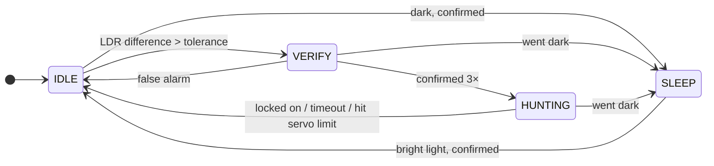

# ☀️ Advanced Solar Tracker v2.0 — FSM Edition

> An Arduino-based solar tracker that actually thinks before it moves, built as a high school physics project by **Kolese Le Cocq d'Armandville Students**.


---

## What is this?

It's a solar panel tracker that uses two LDR sensors to figure out where the light is coming from, then nudges a servo motor until the panel is pointing right at it. Simple idea, but the implementation goes a bit deeper than a basic `if left > right, turn left` loop.

The firmware runs on a **Finite State Machine** with four distinct states, so the tracker isn't just blindly reacting to every sensor blip. It sleeps when it's dark, double-checks before it moves, and knows when to give up and go back to idle. There's also a **Python GUI** you can connect over Serial to watch everything in real time, simulate sensor values, and control the hardware without touching the code.

---

## Features

### Firmware
- **4-state FSM**: `SLEEP`, `IDLE`, `VERIFY`, `HUNTING`. The tracker moves through these in a logical order instead of just reacting to raw sensor data
- **AVR Watchdog sleep**: when it's dark and there's nothing to track, the Arduino actually puts itself to sleep at the hardware level to save power
- **Oversampling**: each LDR is read 4 times per cycle and averaged (with the first throwaway read discarded), so a single noisy reading won't cause a false trigger
- **Confirmation counters**: state transitions only happen after several consistent readings in a row. Shadows, clouds, quick flickers, none of that should send the panel chasing nothing
- **3 runtime modes**: `STANDALONE` (no PC needed), `GUI` (connected to the debugger), and `PRESENTATION` (faster timing for demos)
- **Servo auto-detach**: when the tracker isn't actively moving, the servo gets detached so it's not drawing current or jittering
- **Safety exits**: a 30-second hunt timeout, plus an early exit if the servo hits its angle limit, so it never spins forever
- **Pin 11 output**: stays ON whenever the tracker is awake and turns OFF in `SLEEP`. Can be manually overridden from the GUI
- **Full Serial command interface**: change almost anything at runtime without reflashing

### Python Debugger
- Live **servo position gauge** and **LDR bar graphs** so you can actually see what the hardware is doing
- **LDR simulation sliders**: feed fake sensor values to the Arduino without physically covering the sensors. Really useful for testing edge cases
- **Force-state buttons**: jump to any FSM state directly, great for demos
- **Manual servo control** with attach/detach buttons
- **Pin 11 override** toggle (AUTO / FORCE ON / FORCE OFF)
- **Presentation Window**: a separate display with an animated UI, sky gradient, and smooth servo needle animation. Press `F11` to go fullscreen
- **Heartbeat system**: if the GUI closes or crashes, the Arduino automatically falls back to standalone mode after about 4 seconds
- **Xbox controller support** *(optional, needs `pygame`)*: left stick moves the servo, A button toggles Pin 11. Mostly for fun during demos
- ANSI-colored console output on terminals that support it

---

## Hardware

### What you'll need

- 1× **Arduino Uno or Nano**
- 1× **Servo motor** (a small one like SG90 / MG90S is enough for a light panel)
- 2× **LDR** (light dependent resistor)
- 2× **fixed resistors** for the LDR dividers (**10 kΩ** is a good starting point)
- 1× **LED + ~220 Ω resistor**, *or* a relay module, for the Pin 11 output *(optional)*
- A small **divider wall** between the two LDRs (cardboard, foam, a 3D-printed fin, anything opaque)
- Jumper wires and a breadboard

### Pin map at a glance

| Component | Arduino Pin |
|---|---|
| Servo signal | **D9** |
| Left LDR | **A0** |
| Right LDR | **A1** |
| Output indicator (LED / relay) | **D11** |

### Wiring it up, step by step

**1. Set up the power rails first.**
Run the Arduino's **5V** to the breadboard's `+` rail and **GND** to the `–` rail. Everything below plugs into these two rails, so getting them right first saves a lot of confusion later.

**2. Wire the left LDR (A0).**
An Arduino can't read resistance directly, so each LDR goes into a simple *voltage divider* with a fixed resistor:
- Connect one leg of the fixed resistor to **5V**.
- Connect the other leg of that resistor to one leg of the LDR, and run a jumper from that shared point to **A0**.
- Connect the remaining leg of the LDR to **GND**.

The firmware expects **lower readings = brighter light**. With the LDR on the GND side like this, more light lowers the LDR's resistance, which pulls the voltage at A0 down. That's exactly what the code wants.

**3. Wire the right LDR (A1).**
Same thing, mirrored: fixed resistor to **5V**, LDR to **GND**, and the junction between them to **A1**. Try to use the same resistor value on both sides so the two sensors are a fair match.

**4. Connect the servo (D9).**
A servo has three wires:
- **Signal** (usually orange/yellow) → **D9**
- **Power** (usually red) → **5V**
- **Ground** (usually brown/black) → **GND**

**5. (Optional) Hook up the Pin 11 output (D11).**
For a status LED: **D11 → 220 Ω resistor → LED long leg**, and the LED's short leg → **GND**. For a relay module, connect its `IN` pin to **D11** and power it from 5V / GND. It'll switch ON while the tracker is awake and OFF when it goes to sleep.

**6. Add the divider wall.**
Stand a small opaque wall *between* the two LDRs, perpendicular to the panel. This is what makes the whole thing work: when the sun is off to one side, the wall shades one sensor, creating the difference the tracker reacts to. Without it, both sensors see the same light and the difference stays near zero.

### Quick sanity checks

> 💡 **Panel moves the wrong way?** Flip `IS_FLIPPED` in the config instead of re-wiring. It just reverses the servo direction.

> 💡 **Brightness readings go *up* in the light instead of down?** You swapped the LDR and the resistor. Swap them back so the LDR sits on the GND side.

> ⚡ **Servo twitching or the Arduino randomly resetting?** Servos pull current spikes when they move. If the 5V pin can't keep up (common with bigger servos or USB power), power the servo from a separate 5V supply and **connect that supply's GND to the Arduino's GND**. Shared ground is a must, or the signal won't make sense to the servo.

---

## Configuration

All the tunable values are grouped at the top of `SolarTracker_V2.ino` so you don't have to dig through the code:

```cpp
// Servo range - adjust these if your servo is mounted at a different angle
const bool  IS_FLIPPED  = true;
const int   BATAS_MIN   = 82;    // min angle
const int   BATAS_MAX   = 170;   // max angle

// Light thresholds (0-1023, lower value = brighter light)
const int   BATAS_BANGUN = 650;  // wake up when average brightness is below this
const int   BATAS_TIDUR  = 850;  // go to sleep when average brightness is above this

// How sensitive the tracker is
const int   TOLERANSI      = 20; // minimum LDR difference before the tracker starts moving
const int   TOLERANSI_STOP = 20; // LDR difference at which the tracker considers itself locked on

// How many samples to average per reading
const int   JUMLAH_SAMPLE = 4;
```

### Timing profiles

Each run mode has its own check intervals, defined right below the thresholds:

| Profile | Used when | Vibe |
|---|---|---|
| `*_PROD` | Standalone mode | Currently set to the fast **demo** timings. The slower, more power-efficient "real deployment" values are kept in a commented-out block right above it, so just swap them if you're leaving it outside for real |
| `*_GUI` | Connected to the debugger | Relaxed intervals so the logs stay readable |
| `*_PRES` | Presentation mode | Snappy timings for showing it off live |

The confirmation targets (`VERIFY_COUNT_TARGET`, `DARK_CONFIRM_TARGET`, etc.) and `HUNTING_TIMEOUT` live in the `Are YOU safe?` section if you want the tracker to be more or less cautious.

---

## How the State Machine Works



| State | What's happening |
|---|---|
| `SLEEP` | It's dark. In standalone mode the Arduino drops into hardware sleep and only wakes up occasionally to check if the light came back. Pin 11 turns off. |
| `IDLE` | There's light and the panel is in position. The servo is detached. The tracker is just watching for any light imbalance. |
| `VERIFY` | One LDR is brighter than the other. Before moving anything, the tracker waits for 3 consecutive confirmations to make sure it's not just a flicker. If the difference disappears, it's a false alarm and it goes back to `IDLE`. |
| `HUNTING` | Actively rotating the servo toward the brighter side, one degree at a time, until both LDRs read roughly the same. It bails out after 30 seconds, or if the servo hits the end of its range. |

If it gets dark during `VERIFY` or `HUNTING`, the tracker skips straight to `SLEEP` instead of chasing light that isn't there anymore.

---

## Getting Started

### Flashing the Arduino

You'll need Arduino IDE 1.8+ (or Arduino CLI). The only library used is `Servo.h`, which comes built-in.

1. Open `SolarTracker_V2.ino`
2. Tweak the config constants at the top for your hardware (servo range, light thresholds)
3. Upload to your Arduino Uno or Nano

### Running the Python Debugger

```bash
pip install pyserial
pip install pygame   # optional, only if you want Xbox controller support
```

```bash
python debugger.py
```

Pick your COM port from the dropdown and hit **Connect**. The Arduino automatically switches to GUI mode once it detects the heartbeat signal.

---

## Serial Protocol

The Arduino talks at `115200` baud. All log lines from the firmware start with `LOG:` so they're easy to filter out if you're building your own tooling.

### Commands you can send (PC → Arduino)

| Command | What it does |
|---|---|
| `CMD:PING` | Heartbeat. Keeps the Arduino in GUI mode |
| `CMD:PRES_ON` / `CMD:PRES_OFF` | Switch to/from presentation run mode |
| `CMD:SIM_ON` / `CMD:SIM_OFF` | Enable/disable LDR simulation |
| `CMD:SIM_L:<0-1023>` | Set the simulated left LDR value |
| `CMD:SIM_R:<0-1023>` | Set the simulated right LDR value |
| `CMD:STATE:<0-3>` | Force jump to a specific FSM state |
| `CMD:SERVO:<angle>` | Move servo to a specific angle |
| `CMD:ATTACH` / `CMD:DETACH` | Attach or detach the servo |
| `CMD:PIN11:AUTO` / `ON` / `OFF` | Change Pin 11 output mode |

### Telemetry (Arduino → PC)

When in GUI or Presentation mode, the Arduino sends a `DATA:` packet every 100 ms:

```
DATA:<state>,<pos>,<valL>,<valR>,<selisih>,<rataRata>,<millis>,<verifyCount>,<darkCount>,<brightCount>,<attached>,<simMode>,<pin11Mode>,<pin11State>,<runMode>,<sleepKind>,<sensorAgeMs>
```

---

## File Structure

| File | What it is |
|---|---|
| `SolarTracker_V2.ino` | Arduino firmware |
| `debugger.py` | Python GUI + presentation tool |
| `LICENSE` | MIT License |

---

## Donate me!

[](https://saweria.co/Rehan30g)
[](https://www.paypal.com/paypalme/rehan30g)

## License

Released under the [MIT License](LICENSE). Built for a high school physics class, so feel free to learn from it, remix it, and build your own.
