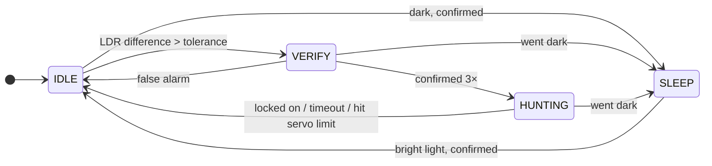

# ☀️ Advanced Solar Tracker v2.0 — FSM Edition

> Arduino solar tracker that actually thinks before it moves. Made for a high school physics project by **Kolese Le Cocq d'Armandville Students**.


---

## What is this?

Two LDRs figure out where the light's coming from, a servo turns the panel toward it. Pretty simple idea. The code just goes a bit further than the usual `if left > right, turn left` loop.

It runs on a **Finite State Machine** with 4 states, so it doesn't freak out every time a sensor blips. It sleeps when it's dark, double-checks before moving, and gives up if it can't find the light. There's also a **Python GUI** you can plug in over Serial to watch stuff live, fake sensor values, and control things without reflashing.

---

## Features

### Firmware
- **4-state FSM**: `SLEEP`, `IDLE`, `VERIFY`, `HUNTING`. Goes through them in order instead of reacting to raw sensor noise
- **AVR Watchdog sleep**: when it's dark the Arduino actually sleeps at the hardware level. saves power
- **Oversampling**: each LDR gets read 4 times and averaged (first read thrown away), so one noisy reading won't mess anything up
- **Confirmation counters**: needs a few consistent readings in a row before switching states. clouds, shadows, flickers, whatever, it mostly ignores them
- **3 run modes**: `STANDALONE` (no PC), `GUI` (hooked to the debugger), `PRESENTATION` (faster timing for demos)
- **Servo auto-detach**: servo gets detached when it's not moving so it doesn't jitter or waste current
- **Safety exits**: 30s hunt timeout, and it also stops if the servo hits its angle limit. no infinite spinning
- **Pin 11 output**: ON while the tracker is awake, OFF in `SLEEP`. can be overridden from the GUI
- **Serial commands**: change most things at runtime, no reflash needed

### Python Debugger
- Live **servo gauge** + **LDR bar graphs**
- **LDR simulation sliders**: fake sensor values without covering the actual sensors. super handy for testing edge cases
- **Force-state buttons**: jump to any state, nice for demos
- **Manual servo control** + attach/detach buttons
- **Pin 11 override** (AUTO / FORCE ON / FORCE OFF)
- **Presentation Window**: separate animated display with a sky gradient and a smooth servo needle. `F11` for fullscreen
- **Heartbeat**: if the GUI closes or crashes, the Arduino goes back to standalone after ~4s
- **Xbox controller support** *(optional, needs `pygame`)*: left stick = servo, A = toggle Pin 11. mostly just for fun tbh
- Colored console output if your terminal supports it

---

## Hardware

### Stuff you need

- Arduino **Uno or Nano**
- 1 **servo** (SG90 / MG90S is fine for a small panel)
- 2 **LDRs**
- 2 **resistors** for the LDRs (**10 kΩ** is a good start)
- LED + ~220 Ω resistor, or a relay module, for Pin 11 *(optional)*
- Something opaque to put **between** the LDRs (cardboard, foam, whatever)
- Jumper wires + breadboard

### Pins

| Component | Arduino Pin |
|---|---|
| Servo signal | **D9** |
| Left LDR | **A0** |
| Right LDR | **A1** |
| Output (LED / relay) | **D11** |

### Wiring

**1. Power rails**
5V to the `+` rail, GND to the `–` rail. do this first, everything else plugs into them.

**2. Left LDR (A0)**
LDR + resistor voltage divider thing. resistor to 5V, LDR to GND, middle bit goes to A0. that's it.

(yes the LDR goes on the GND side, the code wants lower = brighter. don't ask.)

**3. Right LDR (A1)**
Same as the left one but the middle goes to A1. Use the same resistor value on both or they won't match.

**4. Servo (D9)**
- signal (orange/yellow) → D9
- power (red) → 5V
- ground (brown/black) → GND

**5. Pin 11 output (D11)** *(optional)*
LED: D11 → 220 Ω → LED long leg, short leg → GND.
Relay module: `IN` → D11, plus 5V and GND. It's on while the tracker is awake, off when it sleeps.

**6. The divider wall**
Put your cardboard/foam/whatever between the two LDRs, sticking straight up from the panel. This is kinda the whole trick: when the sun's off to one side, the wall shades one LDR and the tracker sees a difference. No wall = both LDRs read the same = nothing happens.

### If something's off

- **Panel turns the wrong way?** Just flip `IS_FLIPPED` in the config. no rewiring needed.
- **Readings go *up* in the light?** You swapped the LDR and resistor. LDR goes on the GND side.
- **Servo twitching / Arduino randomly resetting?** Servo's probably pulling too much current (happens a lot on USB power or with bigger servos). Give it its own 5V supply and **connect that GND to the Arduino GND**. Shared ground is required, otherwise the signal won't work.

---

## Configuration

Everything you'd want to tweak is at the top of `SolarTracker_V2.ino`:

```cpp
// Servo range - adjust these if your servo is mounted at a different angle
const bool  IS_FLIPPED  = true;
const int   BATAS_MIN   = 82;    // min angle
const int   BATAS_MAX   = 170;   // max angle

// Light thresholds (0-1023, lower value = brighter light)
const int   BATAS_BANGUN = 650;  // wake up when average brightness is below this
const int   BATAS_TIDUR  = 850;  // go to sleep when average brightness is above this

// How sensitive the tracker is
const int   TOLERANSI      = 20; // minimum LDR difference before the tracker starts moving
const int   TOLERANSI_STOP = 20; // LDR difference at which the tracker considers itself locked on

// How many samples to average per reading
const int   JUMLAH_SAMPLE = 4;
```

### Timing profiles

Each run mode has its own intervals, right under the thresholds:

| Profile | When | Notes |
|---|---|---|
| `*_PROD` | Standalone | Currently has the fast **demo** timings. The slower "real" ones are commented out right above it, swap them in if you're actually leaving it outside |
| `*_GUI` | Hooked to the debugger | Slower so the logs are readable |
| `*_PRES` | Presentation mode | Fast, for showing it off |

Want it more/less careful? Check `VERIFY_COUNT_TARGET`, `DARK_CONFIRM_TARGET`, `HUNTING_TIMEOUT` etc. in the `Are YOU safe?` section.

---

## How the State Machine Works



| State | What's going on |
|---|---|
| `SLEEP` | It's dark. In standalone mode the Arduino hardware-sleeps and wakes up every now and then to check for light. Pin 11 off. |
| `IDLE` | There's light, panel's in position, servo detached. Just waiting for one side to get brighter. |
| `VERIFY` | One LDR is brighter. Waits for 3 confirmations in a row before moving. If the difference goes away, false alarm, back to `IDLE`. |
| `HUNTING` | Turning toward the brighter side, 1 degree at a time, until both LDRs roughly match. Gives up after 30s or if the servo hits its limit. |

If it gets dark during `VERIFY` or `HUNTING`, it just goes straight to `SLEEP`.

---

## Getting Started

### Flashing the Arduino

Arduino IDE 1.8+ (or Arduino CLI). Only library is `Servo.h`, which is built-in.

1. Open `SolarTracker_V2.ino`
2. Tweak the config at the top for your setup (servo range, light thresholds)
3. Upload to your Uno / Nano

### Running the Python Debugger

```bash
pip install pyserial
pip install pygame   # optional, only if you want Xbox controller support
```

```bash
python debugger.py
```

Pick your COM port, hit **Connect**. The Arduino switches to GUI mode by itself once it gets the heartbeat.

---

## Serial Protocol

`115200` baud. Every log line from the firmware starts with `LOG:` so you can filter them out easily if you're making your own tool.

### Commands you can send (PC → Arduino)

| Command | What it does |
|---|---|
| `CMD:PING` | Heartbeat. Keeps the Arduino in GUI mode |
| `CMD:PRES_ON` / `CMD:PRES_OFF` | Switch to/from presentation run mode |
| `CMD:SIM_ON` / `CMD:SIM_OFF` | Enable/disable LDR simulation |
| `CMD:SIM_L:<0-1023>` | Set the simulated left LDR value |
| `CMD:SIM_R:<0-1023>` | Set the simulated right LDR value |
| `CMD:STATE:<0-3>` | Force jump to a specific FSM state |
| `CMD:SERVO:<angle>` | Move servo to a specific angle |
| `CMD:ATTACH` / `CMD:DETACH` | Attach or detach the servo |
| `CMD:PIN11:AUTO` / `ON` / `OFF` | Change Pin 11 output mode |

### Telemetry (Arduino → PC)

In GUI or Presentation mode, the Arduino sends a `DATA:` packet every 100 ms:

```
DATA:<state>,<pos>,<valL>,<valR>,<selisih>,<rataRata>,<millis>,<verifyCount>,<darkCount>,<brightCount>,<attached>,<simMode>,<pin11Mode>,<pin11State>,<runMode>,<sleepKind>,<sensorAgeMs>
```

---

## Files

| File | What it is |
|---|---|
| `SolarTracker_V2.ino` | Arduino firmware |
| `debugger.py` | Python GUI + presentation tool |
| `LICENSE` | MIT License |

---

## Donate me!

[](https://saweria.co/Rehan30g)
[](https://www.paypal.com/paypalme/rehan30g)

## License

[MIT](LICENSE). Made for a physics class, do whatever you want with it.
